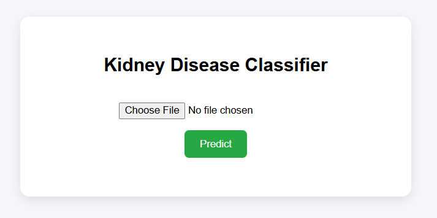
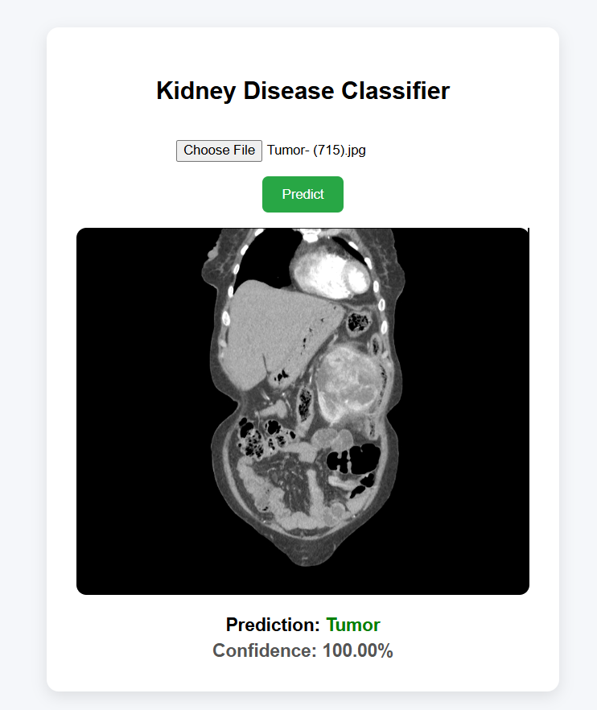

# Kidney Disease Classification

## Running the application

### STEPS 01:
Clone the repository
```bash
git clone https://github.com/ShamsudeenLawal/kidney-disease-classification.git
```

### STEP 02:
Move into the repository directory
```bash
cd kidney-disease-classification
```

### STEP 03: Create a conda environment

```bash
conda create -n kdc_env python=3.9 -y
```

### STEP 04: Activate the created conda environment
```bash
conda activate kdc_env
```

### STEP 05: Install the requirements
```bash
pip install -r requirements.txt
```


### STEP 06: Launch the application
On windows:
```bash
python app.py
```
On Linux:
```bash
python3 app.py
```

### STEP 07: Make Predictions
- Open http://127.0.0.1:5000/ on your web browser
- Select file from test-images directory in the cloned repository directory
- Press Predict button to get predictions

<p align="center">
  <br>
  <em>Before Prediction</em>
</p>

<p align="center">
  <br>
  <em>Sample Prediction</em>
</p>

## To Train a new model
You can experiment with params.yaml if you know what you are doing, a guide for modification is included
```bash
python main.py
```
On Linux:
```bash
python3 main.py
```